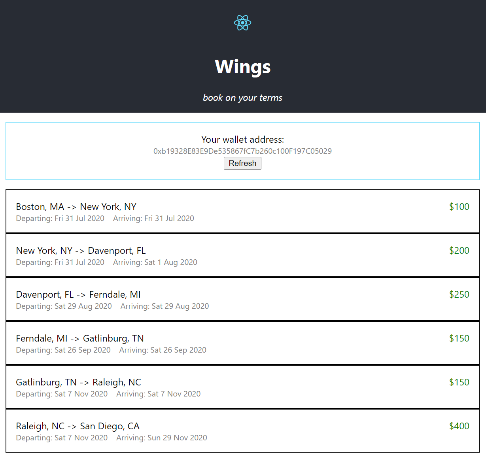
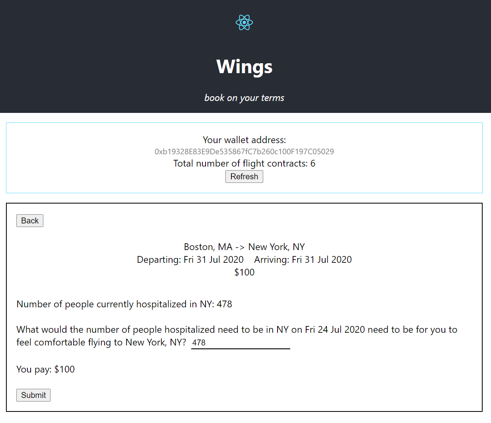

# What's your project called?

Wings

# Here's the elevator pitch

The platform offering smart contracts between consumers and airlines to allow for more flexible travelling.

# It's built with

- truffle
- solidity
- react
- npm 
- node.js
- aws
- github-actions
- terraform

# Here's the whole story

## Inspiration
We browsed through some example projects last year and saw a common theme in projects that utilized smart contracts. It was an idea that was new to us. We decided that this would be an awesome opportunity to explore what smart contracts were and how to build one.

As digital nomads, one of the first places we booked was Orlando, Florida. However, this was months before the number of Coronavirus cases spiked. We would have loved to been able to condition our Airbnb and travel arrangements based on how safe it would be in our destination location. Which inspired us to land on the idea for Wings!

## What it does
Allows consumers and airlines to create smart contracts for travel, conditioned on data we feed in from the outside world. For example, Coronavirus cases.

## How I built it
Used a Create-React-App on the front end, Truffle/Solidity on the backend. We went with a factory pattern, where we have one contract managing all of our child contracts that get created. We stood up our own EC2 and RDS instances on AWS to run our own Chainlink node.

## Challenges I ran into
This was our first exposure to blockchain and Chainlink. So there was a lot to learn in terms of standing up the contracts, running our own node, and getting an end-to-end workflow working.

## Accomplishments that I'm proud of
Running our own Chainlink node and seeing actual contracts managed on the blockchain.

## What I learned
Truffle, Solidity, Chainlink, and blockchain technologies in general

## What's next for Wings
We'd like to add more types of conditions to the flight contracts. Examples include weather, sports playoff outcomes, and better flight deals becoming available.

# Images

Homepage

Booking a Flight

